# Agora — Multi-Agent Operations

**Owner**: architect | This is the operating manual for **several AI dev agents**
working in parallel on this repository.

---

## 1. Agent roster

| Agent | Role | Labels it works on | Typical work |
| --- | --- | --- | --- |
| Architect | Design authority | `agent:architect`, `epic`, `spec` | ADRs, specs approval, contracts, cross-cutting decisions |
| Backend | Services & data | `agent:backend`, `area:*` (services) | modules, jobs, integrations, migrations |
| Frontend | Applications & UI | `agent:frontend`, `area:frontend` | pages, components, design system, a11y |
| DevOps | Delivery & infra | `agent:devops`, `area:infra` | CI/CD, Docker/Terraform, observability |
| QA | Verification | `agent:qa` | test plans, E2E, load tests, acceptance runs |
| Security | Trust & safety | `agent:security` | threat model, auth, scans, incident review |

## 2. How work flows

```mermaid
graph LR
  A[Epic issue] --> B[Spec kit: spec.md]
  B --> C[Spec approved]
  C --> D[plan.md + tasks.md]
  D --> E[taskstoissues → GitHub issues]
  E --> F[Project board: Backlog]
  F --> G[Agent claims issue\n+ sets role label]
  G --> H[branch feat/x]
  H --> I[PR → CI green → review]
  I --> J[Merge to main → staging]
  J --> K[converge pass]
```

**Rules:**

1. **One agent, one issue at a time** in `In Progress`. Claim by assigning
   yourself and moving the item.
2. **Never edit `main` directly.** Branch per issue
   (`feat/<issue>-<slug>`), PR links the issue (`Closes #N`).
3. **Dependency discipline**: an issue stays `Blocked` until its
   dependencies (tracked via `depends on` on the board) are done.
4. **Parallel safety**: two agents never touch the same module/schema in
   the same sprint; the architect assigns module ownership per milestone.
   Schema migrations are the highest-collision area — coordinate on the
   `Migrations` thread of each epic.
5. **Conflict resolution**: code review is the court; the architect breaks
   ties; escalate via issue comment, never silently.

## 3. Claiming and reporting

- On claim: set board Status `In Progress`, assign yourself, comment the
  approach in 2–4 lines.
- On PR: board Status `In Review`; add the PR link to the issue.
- On merge: status `Done` only after CI green and staging smoke passed.
- Keep the issue description's checklist updated (epics) — the board is
  the source of truth for management, issues for detail.

## 4. Multi-agent coordination points

| Coordination point | Mechanism |
| --- | --- |
| API contracts | `packages/contracts` — single source of truth; changing a contract requires the consuming side in the same PR or a versioned additive change |
| DB schema | Prisma migrations; no two agents migrate the same schema in parallel; migration files are merge-conflict-prone — sequentialize |
| Design system | `packages/ui` — additive only; breaking changes need a changeset + Storybook update |
| Environment | `docker compose` files and `.env.example` are shared; env changes go in the same PR as the code that needs them |
| Specs | specs are write-once-per-milestone; amendments go through the architect |

## 5. Spec Kit commands available

The Spec Kit slash commands are installed for Claude Code under
`.claude/commands/`:

| Command | Use |
| --- | --- |
| `/speckit.constitution` | (re)generate the constitution (AGENTS.md) |
| `/speckit.specify` | write a feature spec from a brief |
| `/speckit.clarify` | interrogate underspecified areas before planning |
| `/speckit.plan` | technical implementation plan for a spec |
| `/speckit.tasks` | dependency-ordered task list from a plan |
| `/speckit.taskstoissues` | convert tasks to GitHub issues (labels, deps) |
| `/speckit.analyze` | cross-artifact consistency/coverage check |
| `/speckit.implement` | execute tasks against the spec |
| `/speckit.converge` | assess code vs spec and append remaining work |
| `/speckit.checklist` | generate a quality checklist for a spec |

Use them at the start of every milestone to decompose epics into issues.

## 6. Definition of Ready / Done

**Ready** (issue can be picked): spec linked & approved, acceptance
criteria present, dependencies done, labels set.

**Done** (AGENTS.md §3): code + tests + docs + observability + no secrets
+ CI green + merged + staging smoke.

## 7. Onboarding checklist for a new agent

1. Read `AGENTS.md` (constitution) and this file.
2. Read `docs/architecture.md` + `docs/decisions/` (ADRs).
3. `cp .env.example .env`, `docker compose up -d`, `pnpm install`, run dev.
4. Pick a `good-first-issue` labeled task to learn the loop.
5. Ask the architect (issue comment) before touching ADRs, contracts, or
   migrations outside your issue.
