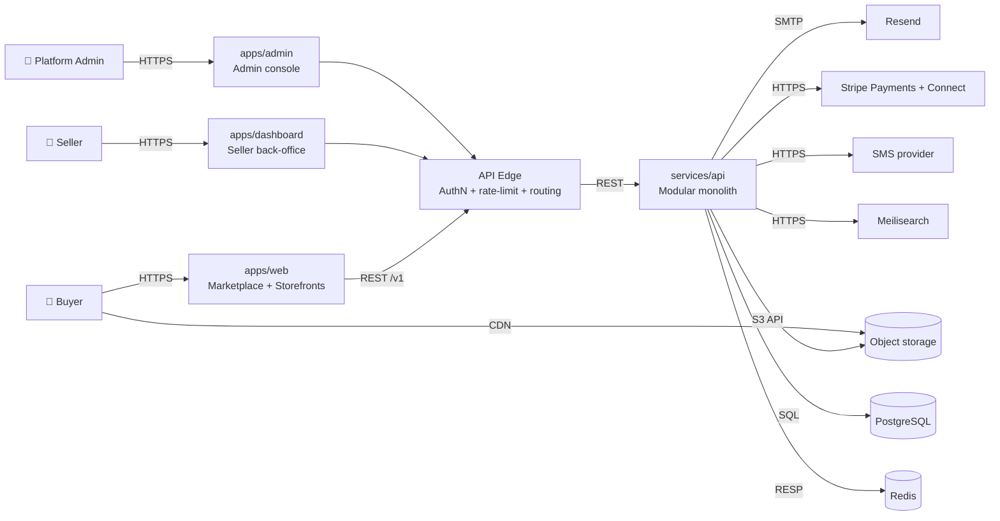
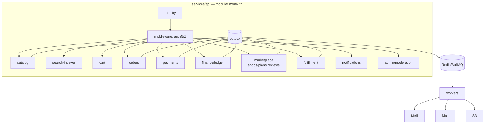
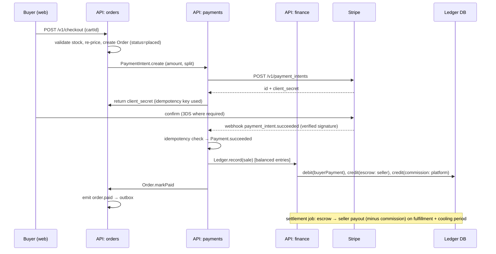
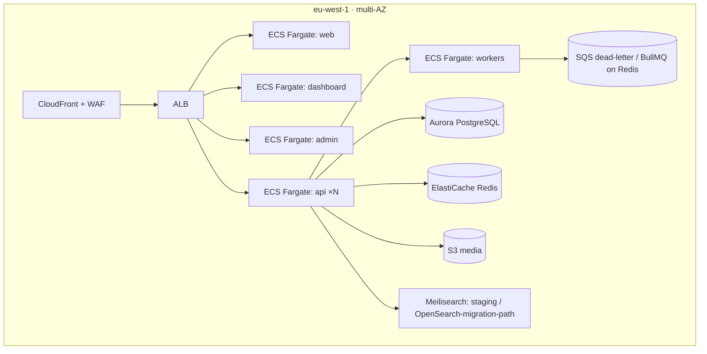

# Agora — System Architecture

**Status**: Ratified | **Owner**: architect | **Related ADRs**: all of `docs/decisions/`

This document is the single source of truth for how Agora is built. It is
written at C4 level 1–3: context, containers, and the components of the
critical commerce flow.

---

## 1. Goals & Non-Functional Requirements

| # | NFR | Target |
| --- | --- | --- |
| NFR-1 | Availability | 99.9% monthly (multi-AZ, zero-downtime deploys) |
| NFR-2 | Checkout latency | p95 < 800 ms end-to-end |
| NFR-3 | Search latency | p95 < 150 ms |
| NFR-4 | Throughput | 1,000 concurrent buyers, 100 orders/min at launch; scale test at 10× |
| NFR-5 | Security | PCI-DSS SAQ-A (Stripe), GDPR, OWASP ASVS L2 |
| NFR-6 | Data integrity | Money moves only through double-entry ledger; zero silent loss |
| NFR-7 | Observability | 100% of requests traced; SLOs monitored; on-call runbooks |
| NFR-8 | Development | Trunk-based, full CI in < 10 min, deployable on demand |
| NFR-9 | Extensibility | New payment/shipping providers behind ports/adapters |

---

## 2. Context (C4 L1)

**External actors**: Buyers, Sellers, Platform Admins, Payment networks
(Stripe), Email/SMS providers, and third-party integrations via the public
API (OAuth2 client-credentials).

---

## 3. Containers (C4 L2)

### 3.1 Runtime containers

| Container | Tech | Responsibility |
| --- | --- | --- |
| `web` | Next.js 15 (App Router, RSC) | Buyer experience: browse, search, product pages, cart, checkout, shop storefronts |
| `dashboard` | Next.js 15 | Seller ops: catalog, inventory, orders, fulfillment, payouts, analytics, subscription |
| `admin` | Next.js 15 | Platform ops: moderation, disputes, KYC, commissions, audit |
| `api` | Node 20 + Fastify (modular monolith) | All business logic, 11 bounded-context modules (below) |
| `workers` | Node 20 + BullMQ | Async jobs: outbox relay, search index, emails, media processing, payouts, digest |
| `db` | PostgreSQL 16 (Aurora in prod) | System of record, schema-per-module |
| `cache/queue` | Redis 7 (ElastiCache in prod) | Cache, BullMQ queues, rate-limit counters, idempotency keys |
| `search` | Meilisearch | Typo-tolerant full-text + faceted product search |
| `media` | S3/MinIO + CloudFront | Product images/video, presigned uploads, CDN delivery |
| `edge` | ALB + CloudFront + WAF | TLS termination, rate limiting, bot protection, static delivery |

### 3.2 The API as a modular monolith

One deployable (`services/api`) containing eleven bounded contexts. Each
module owns its tables, its public interface (module facade), and its
events. Modules may be extracted into standalone services later without
rewrites — the interface and event contracts are already service-shaped.

### 3.3 Module responsibilities

| Module | Owns | Key rules |
| --- | --- | --- |
| **identity** | users, credentials, sessions, MFA, roles/permissions, audit | Argon2id, RS256 JWT rotation, refresh rotation, RBAC matrix (ADR-0007) |
| **marketplace** | shops, seller plans (Free/Plus/Pro), commissions config, reviews/ratings, seller KYC | shop = tenant of catalog+orders; plan gates features |
| **catalog** | products, variants, SKUs, categories, attributes, media links, inventory | published products only are searchable; stock decremented at order placement (reserved) |
| **search-indexer** | read-side projection, Meilisearch sync | event-driven reindex, eventually consistent (< 5 s) |
| **cart** | carts, cart items, price snapshot | idempotent merge, TTL expiry, price revalidation at checkout |
| **orders** | orders, order lines, status state machine, refunds/returns requests | immutable order lines (price snapshot); state machine: `placed → paid → fulfilled → completed`, `canceled`, `refunded` |
| **payments** | payment intents, provider adapters (Stripe primary), webhooks, idempotency | provider abstraction (ADR-0006); capture → notify ledger; never touch PAN |
| **finance** | double-entry ledger: accounts, journal entries, escrow, commission split, payouts | every money movement is a balanced entry; escrow holds seller funds until settlement (ADR-0006) |
| **fulfillment** | shipping methods, labels, tracking, delivery status | provider-agnostic, webhook-updated |
| **notifications** | templates, outbound events (email/SMS/in-app), digests, webhooks to sellers | idempotent sends, retry with backoff, unsubscribe handling |
| **admin** | moderation queue, disputes, KYC review, platform config, audit queries | admin actions are themselves audited |

---

## 4. Money Flow (the critical path)

**Invariants**: one PaymentIntent per order; idempotency keys everywhere;
a webhook is the source of truth for payment state; ledger entries are
append-only and always balanced; platform never holds funds beyond escrow.

---

## 5. Data Architecture

- **One PostgreSQL database, schema-per-module** (`identity`, `marketplace`,
  `catalog`, `orders`, `payments`, `finance`, `notification`, `audit`).
  Cross-schema joins are forbidden; modules communicate via facade + events.
- **Prisma** is the schema source of truth; migrations in the same PR as the
  change (ADR-0003).
- **Outbox pattern**: transactional write → outbox row → worker relays to
  queue → consumers (search, email, webhooks) (ADR-0005).
- **Idempotency**: `Idempotency-Key` header on all mutating POSTs; key stored
  with 24 h TTL, 409 on mismatch.
- **Money**: integer minor units everywhere; ledger with accounts + journal
  entries; no floats (AGENTS.md §7).

Full entity catalog: [docs/data-model.md](data-model.md).

---

## 6. API Surface

- REST over HTTPS, versioned `/v1/*`, OpenAPI 3.1 contracts generated from
  `packages/contracts` (the single source of truth — Zod schemas → OpenAPI).
- Auth: bearer access token (buyer/seller/admin), OAuth2 client-credentials
  for third-party integrations; scoped permissions per role.
- Errors: RFC 7807 problem+json, stable error codes, no stack traces.
- Pagination: cursor-based; filtering: query params, documented per endpoint.
- Webhooks out (to sellers/integrations): HMAC-signed, retry with backoff,
  replay protection via `X-Agora-Delivery` header.
- Rate limits: per-token and per-IP, enforced at edge + API (ADR-0011).

---

## 7. Deployment Topology

- **Local**: `docker compose up -d` reproduces the same topology
  (postgres/redis/minio/meilisearch).
- **Staging**: full AWS stack, synthetic checkout every 5 min.
- **Production**: multi-AZ, autoscaling on CPU + queue depth, blue/green ECS
  deploys, DB migrations run as a pre-deploy step with expand/contract.
- **Infra as code**: Terraform modules under `infra/` (ADR-0010).

---

## 8. Observability & SLOs

- Traces: OpenTelemetry (all HTTP + queue jobs) → Tempo. Logs: pino JSON →
  Loki. Metrics: Prometheus → Mimir. Dashboards + alerting: Grafana.
- Sentry for error tracking across all apps.
- SLOs: checkout success ≥ 99.5%, order API p95 ≤ 800 ms, search p95 ≤
  150 ms, queue lag ≤ 60 s at p95. Error budget alerts on fire.
- Details: [docs/observability.md](observability.md).

---

## 9. Security Posture

- AuthN: JWT RS256 (rotated), refresh rotation, TOTP MFA, device
  revocation; sellers/admins require MFA to be enabled.
- AuthZ: RBAC matrix (buyer/seller/staff/admin + scopes), every endpoint
  declares required permissions.
- Secrets: AWS Secrets Manager; no secrets in code or CI logs.
- PCI: out of scope via Stripe (SAQ-A); card data never touches our
  servers.
- GDPR: right to erasure, data export, retention policies, audit log.
- Threat model + ASVS mapping: [docs/security.md](security.md).

---

## 10. Evolution & Extraction Triggers

The monolith is deliberately module-shaped. Extract a module into a
standalone service when at least two of:

1. A module team forms with independent deploy cadence;
2. Load profile diverges (e.g. search traffic explodes);
3. Regulatory isolation is required (finance/payments in some markets).

Extraction path: facade → HTTP boundary → own DB schema (already isolated) →
own deployable. Events already decouple consumers.

## 11. Document Map

- Domain entities: [data-model.md](data-model.md)
- Security & threat model: [security.md](security.md)
- Observability & SLOs: [observability.md](observability.md)
- Operations & runbooks: [operations.md](operations.md)
- Delivery roadmap: [roadmap.md](roadmap.md)
- Decisions: [docs/decisions/](decisions/)
