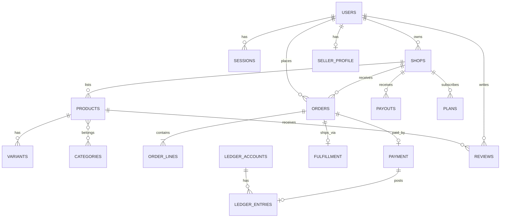

# Agora — Data Model

**Owner**: architect | **Schema source of truth**: `packages/db` (Prisma)

Single PostgreSQL database, **schema per bounded context**. Cross-schema
references use IDs only (no FK across schemas except within a context).
All money in integer minor units. All tables carry `created_at`,
`updated_at`; audited tables carry `created_by`.

---

## Context diagram

## identity schema

| Table | Key fields | Notes |
| --- | --- | --- |
| `users` | id, email (unique, citext), phone, status, locale, password_hash (Argon2id, nullable for social), mfa_enabled, mfa_secret_enc, mfa_backup_codes, email_verified_at, last_login_at, kyc_state | status: `unverified / active / suspended / deleted` |
| `sessions` | id, user_id, refresh_token_hash, family_id, ip, ua, expires_at, revoked_at | refresh rotation; one family per device |
| `roles` / `role_assignments` | name, scope, user_id | RBAC: buyer, seller, staff, admin; scoped per shop |
| `permissions` | key, description | fine-grained: `catalog:write`, `payouts:approve`… |
| `audit_events` | actor, action, target, meta jsonb, ip, at | append-only, 400 d retention |
| `one_time_tokens` | user_id, purpose (email_verification/password_reset), token_hash (sha256), expires_at, used_at | single-use, purpose-scoped |
| `seller_profiles` | user_id (unique), full_name, phone, country, bio | onboarding step 1 |

## marketplace schema

| Table | Key fields | Notes |
| --- | --- | --- |
| `shops` | id, owner_id, slug (unique), name, logo_media_id, status, plan_id, payout_account_id | status: `draft / active / suspended` |
| `plans` | id, code (free/plus/pro), price_minor, features jsonb, billing_cycle | feature flags gate: custom domain, bulk import, lower commission |
| `shop_plan_subscriptions` | shop_id, plan_id, status, period_start/end, auto_renew | billing via Stripe subscriptions |
| `commission_configs` | shop_id, category_id?, percent, fixed_minor | default from platform config |
| `reviews` | id, order_line_id (unique), buyer_id, product_id, shop_id, rating 1-5, title, body, status | published after moderation or auto (trust signals) |
| `disputes` | id, order_id, opened_by, reason, status, resolution, evidence jsonb | state machine: `open → under_review → resolved/refunded` |
| `seller_kyc` | shop_id, entity_type, docs refs, verification_state | manual + provider-assisted |

## catalog schema

| Table | Key fields | Notes |
| --- | --- | --- |
| `products` | id, shop_id, slug, title, description, status (`draft/published/archived`), currency, base_price_minor, media (jsonb ids), attributes jsonb, meta (SEO) | published only when valid + shop active |
| `variants` | id, product_id, sku (unique per shop), option_values jsonb, price_minor, compare_at_minor, stock | stock = integer units |
| `inventory_movements` | id, variant_id, delta, reason (`sale/reservation/adjust/restock`), reference_id | append-only |
| `categories` | id, parent_id, slug, name, attributes_schema jsonb | tree, single parent |
| `product_categories` | product_id, category_id | many-to-many |
| `media_assets` | id, owner_type/owner_id, bucket_key, mime, width/height, size, checksum, status | processing states: `pending → ready/failed` |

## orders schema

| Table | Key fields | Notes |
| --- | --- | --- |
| `carts` | id, user_id, status (`open/checked_out/abandoned`), currency | TTL 30 d |
| `cart_items` | id, cart_id, variant_id, qty, unit_price_minor (snapshot), shop_id | |
| `orders` | id, number, buyer_id, shop_id, status, totals jsonb (subtotal/shipping/tax/commission), currency, placed_at | status machine enforced in code |
| `order_lines` | id, order_id, variant_id, title snapshot, qty, unit_price_minor, line_total_minor, status | immutable after placement |
| `order_status_events` | id, order_id, from, to, at, actor, reason | full history, powers audit + support |

## payments & finance schemas

| Table | Key fields | Notes |
| --- | --- | --- |
| `payment_intents` | id, order_id, provider, provider_payment_id, amount_minor, currency, status, idempotency_key (unique) | status mirrors provider webhooks |
| `provider_accounts` | id, shop_id, provider, external_id, state (Stripe Connect) | seller payout destinations |
| `ledger_accounts` | id, code (unique), type (`asset/liability/equity/revenue/expense`), name, currency | chart of accounts |
| `journal_entries` | id, reference (unique, e.g. order id), memo, posted_at | |
| `ledger_entries` | id, journal_id, account_id, direction (debit/credit), amount_minor, currency, metadata jsonb | always balanced per journal |
| `payouts` | id, shop_id, provider_payout_id, gross_minor, fee_minor, net_minor, status, period | state machine `scheduled → processing → paid/failed` |

Ledger invariants: for every journal, Σdebits = Σcredits; ledger_entries
append-only; adjustments require a new journal (never UPDATE).

## notification schema

| Table | Key fields | Notes |
| --- | --- | --- |
| `notification_templates` | id, channel, event, locale, subject, body (mjml) | versioned |
| `notifications` | id, user_id, channel, event, payload jsonb, status (`queued/sent/delivered/failed`), attempt_count, next_attempt_at | idempotent by (user, event, reference) |
| `webhook_endpoints` | id, shop_id, url, secret_enc, events[], enabled | seller integrations |
| `webhook_deliveries` | id, endpoint_id, event, payload, response_status, attempts | retry 5× backoff |

## audit schema

| Table | Key fields | Notes |
| --- | --- | --- |
| `audit_events` | id, actor_type/id, action, resource_type/id, diff jsonb, ip, ua, at | append-only; admin + money actions mandatory |

---

## Conventions

- IDs: `uuidv7` (time-ordered) — index-friendly, no coordinator needed.
- Money: `BigInt`-backed minor units; JSON serialization as strings.
- Enums: PostgreSQL enums for statuses; new states require migration.
- Soft deletes only for shops/products (with `deleted_at`); users are
  anonymized (GDPR) rather than hard-deleted.
- Timestamps: `timestamptz` UTC.
